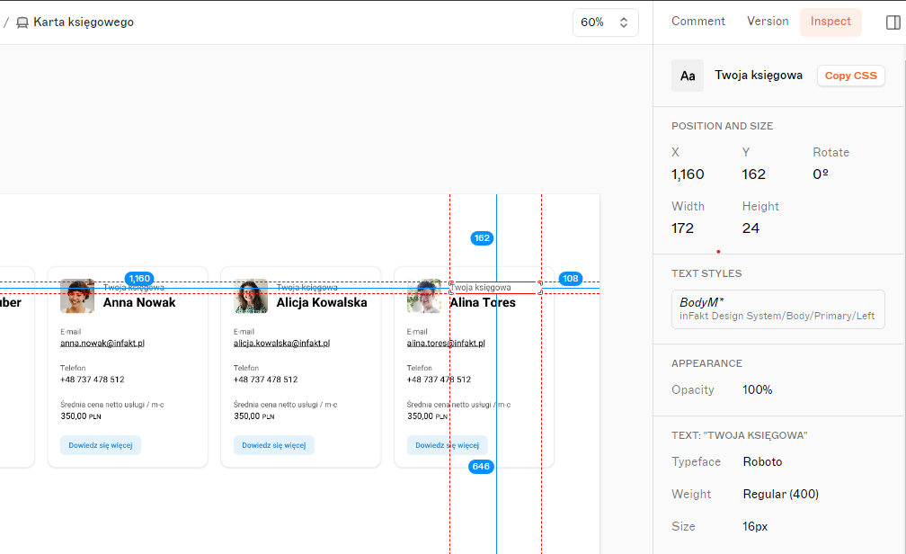

## Zadanie testowe na pozycję React Developer

Cel: stworzenie widoku z kartami księgowych z możliwością doładowania kolejnych kart po wciśnięciu przycisku.

Dla wykonania zadania może być użyte dane repozytorium jako szablon, lub można użyć template create-react-app:

```
npx create-react-app my-app --template typescript
```

Makieta: https://www.sketch.com/s/b0736a6b-3a81-4863-95b6-4ec6775a20e3/a/dg1Gl5l
(W boczym menu sketch w prawym górnym rogu w zakładce "Inspect" mamy możliwość podglądu właściwości elementów karty księgowego)



Opis zadania:

Używając danych z dostarczonego publicznego API, stwórz widok wyświetlający listę księgowych.
Karta księgowego powinna być stworzona według projektu z załączonego powyżej linku.
Na dole, pod listą kart księgowych, powinien znajdować się przycisk pozwalający na załadowanie kolejnych kart z informacjami o księgowych

Kryteria wykonania:

1. Zadanie wykonane w React z użyciem TypeScript
2. Brak blędów w konsoli przeglądarki
3. Repozytorium z zadaniem powinno się znajdować na github i mieć publiczny dostęp dla możliwości podglądu
4. Projekt powinien zostać udostępniony online na jednej z platform wg. własnego uznania (np. github pages, netlify, vercel, etc.)
5. Mile widziane jest użycie css in js (np. styled components).

- Zadanie dodatkowe: umieszczenie widoku kart księgowych pod linkiem /ksiegowi używając React Router (czyli dodanie routingu)

Po wykonaniu zadania należy udostępnić link do repozytorium oraz link dla podglądu wykonanego zadania.

#### API

Link do API: https://randomuser.me/api/ (dokumentacja - https://randomuser.me/documentation)
Używane parametry:

- seed
- gender
- page
- results

Przykładowy link: https://randomuser.me/api/?seed=abc&gender=female&page=1&results=5

Dane z API wyświetlene w karcie księgowego:

```
type AccountantType = {
  cell: string; // numer telefonu
  name: {
    first: string;
    last: string;
  };
  email: string;
  picture: { thumbnail: string; medium: string };
  login: {
    uuid: string;
  };
};
type AccountantResponseType = {
  results: AccountantType[];
  info: {
    page: number;
  };
};

```
